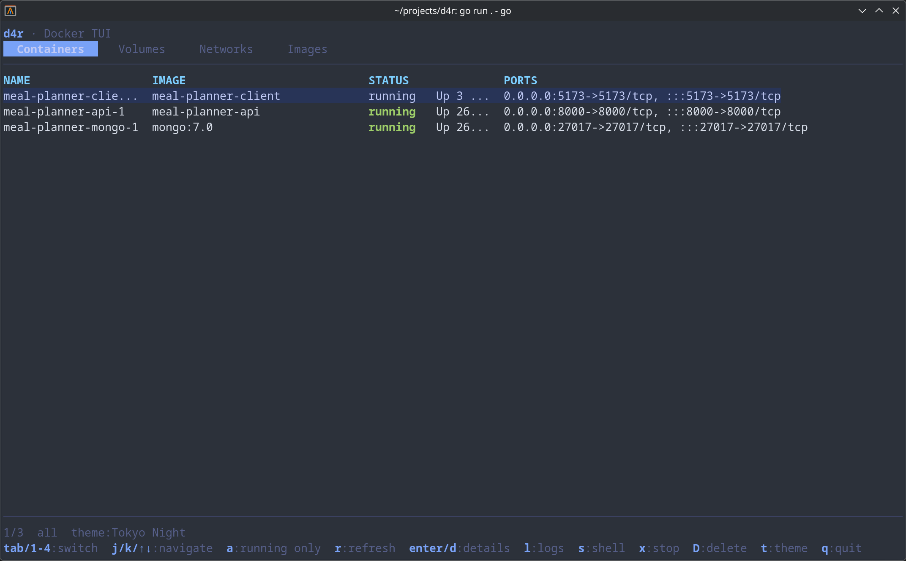

# d4r

A terminal UI for Docker. Manage containers, volumes, networks, and images.



## Features

**Containers**
- Lists all containers by default (running and stopped) — press `a` to narrow to running-only
- View inspect details
- Start / stop / delete (with confirmation)
- Tail and follow logs
- Shell into a running container

**Volumes**
- List volumes with size and reference count
- View inspect details
- Delete (with confirmation)
- Backup to a `.tar.gz` archive
- Restore from a `.tar.gz` archive

**Networks**
- List networks with subnet/gateway info
- View inspect details
- Delete (with confirmation)

**Images**
- List images with size and tags
- View inspect details
- Delete (with confirmation)

**Themes**
- Five built-in themes: Charm, Dracula, Tokyo Night, Base16, Catppuccin
- Press `t` to open the theme picker — the UI previews each theme live as you navigate
- Selected theme is persisted to `~/.config/d4r/config.toml`

## Requirements

- [Go](https://go.dev/) 1.21 or later
- Docker daemon running and accessible (local socket or via `DOCKER_HOST`)

## Build

```sh
git clone <repo-url>
cd d4r
go build -o d4r .
```

Or run without installing:

```sh
go run .
```

## Install

### Prebuilt binary (recommended)

```sh
curl -fsSL https://raw.githubusercontent.com/dchill72/d4r/main/install.sh | sh
```

Or review first, then run locally:

```sh
curl -fsSLO https://raw.githubusercontent.com/dchill72/d4r/main/install.sh
sh install.sh
```

Optional install variables:

```sh
# install a specific version (accepts v-prefixed tags or plain versions)
D4R_VERSION=v0.1.0 sh install.sh
D4R_VERSION=0.1.0 sh install.sh

# install from another repo (forks/private mirrors)
D4R_REPO=owner/repo sh install.sh

# install to a custom path
INSTALL_DIR="$HOME/.local/bin" sh install.sh
```

### Build from source

```sh
go install .
```

This places `d4r` in your `$GOPATH/bin` (ensure it is in `$PATH`).

## Releases

Tagged pushes like `v0.1.0` trigger the release workflow in `.github/workflows/release.yml`, which uses GoReleaser to publish checksummed tarballs for:

- `linux/amd64`
- `linux/arm64`
- `darwin/amd64`
- `darwin/arm64`

Release tags are `vX.Y.Z`, while archive names use `X.Y.Z` (without the `v`). The installer handles this automatically.

## Usage

```sh
./d4r
```

Respects the standard Docker environment variables — set `DOCKER_HOST` to point at a remote or rootless daemon:

```sh
DOCKER_HOST=ssh://user@host ./d4r
```

## Configuration

Config is stored at `~/.config/d4r/config.toml` and is created automatically on first theme selection.

```toml
theme = "dracula"
```

Available theme values: `charm`, `dracula`, `tokyo-night`, `base16`, `catppuccin`

## Key Bindings

### Global

| Key | Action |
|-----|--------|
| `Tab` / `Shift+Tab` | Cycle between tabs |
| `1` `2` `3` `4` | Jump to Containers / Volumes / Networks / Images |
| `j` / `k` / `↑` / `↓` | Navigate list |
| `F5` | Refresh |
| `c` | Open Docker context modal |
| `t` | Open theme picker |
| `q` / `Ctrl+C` | Quit |

### Containers

| Key | Action |
|-----|--------|
| `a` | Toggle all containers / running-only |
| `Enter` / `d` | View details |
| `l` | View logs |
| `s` | Shell into container (`exit` to return) |
| `x` | Stop container (confirmation required) |
| `u` | Start / unpause container |
| `D` | Delete container (confirmation required) |

### Volumes

| Key | Action |
|-----|--------|
| `Enter` / `d` | View details |
| `b` | Backup volume to a `.tar.gz` file |
| `r` | Restore volume from a `.tar.gz` file |
| `D` | Delete (confirmation required) |

**Backup** prompts for a destination path (relative to the current working directory), defaulting to `<volume-name>-<timestamp>.tar.gz`. If any containers using the volume are running, you are asked to confirm stopping them; they are restarted automatically once the backup completes. The archive is created by a temporary `alpine` container with the volume mounted read-only. [Example](./img/d4r-volume-backup.png)

**Restore** prompts for a source archive path. Before proceeding, d4r lists the archive contents and asks you to confirm. You then choose the restore mode:

- **merge** — extracts the archive on top of existing volume contents, leaving unrelated files in place
- **replace** — clears the volume entirely before extracting

As with backup, any running containers that use the volume are stopped for the duration and restarted afterwards. [Example](./img/d4r-volume-restore.png)

### Networks, Images

| Key | Action |
|-----|--------|
| `Enter` / `d` | View details |
| `D` | Delete (confirmation required) |

### Detail / Log view

| Key | Action |
|-----|--------|
| `j` / `k` / `↑` / `↓` | Scroll |
| `PgUp` / `PgDn` | Page scroll |
| `f` | Toggle log follow (logs view only) |
| `Esc` / `q` | Back to list |

### Theme picker

| Key | Action |
|-----|--------|
| `j` / `k` / `↑` / `↓` | Navigate themes (live preview) |
| `Enter` | Select and save theme |
| `Esc` | Cancel (reverts to previous theme) |

### Confirmation prompt

| Key | Action |
|-----|--------|
| `y` | Confirm action |
| `n` / `Esc` | Cancel |
